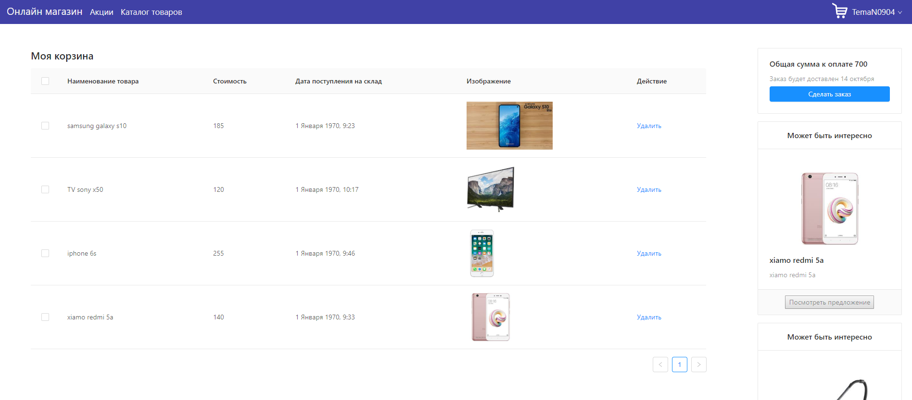

## Building a Online Shop App with Spring Boot, Spring Security, JWT, React and Ant Design



### Tutorials

## Steps to Setup the Spring Boot Back end app (websiteBackend)

1. **Clone the application**

	```bash
	git clone https://github.com/goodFancier/Shop.git
	cd polling-app-server
	```

2. **Create MySQL database**

	```bash
	create database onlineShop
	```
	Also, I prepared a data backup for faster testing `onlineShop.sql`

3. **Change MySQL username and password as per your MySQL installation**

	+ open `src/main/resources/application.properties` file.

	+ change `spring.datasource.username` and `spring.datasource.password` properties as per your mysql installation

4. **Run the app**

	You can run the spring boot app by typing the following command -

	```bash
	mvn spring-boot:run
	```

	The server will start on port 8080.

5. **Default Roles**
	
	The spring boot app uses role based authorization powered by spring security. You need to execute this script.

	```sql
	INSERT IGNORE INTO roles(name) VALUES('ROLE_USER');
	INSERT IGNORE INTO roles(name) VALUES('ROLE_ADMIN');
	```

	Any new user who signs up to the app is assigned the `ROLE_USER` by default.

## Steps to Setup the React Front end app (websiteFrontend)

First go to the `websiteFrontend` folder -

```bash
cd websiteFrontend
```

Then type the following command to install the dependencies and start the application -

Before you can start the server you need to install some dependencies. You can do this in automatically just by running a few commands.

* npm install -g create-react-app 
* npm install antd react-router-dom --save 
* npm install react-app-rewired babel-plugin-import react-app-rewire-less --save-dev
* npm install --save react-autocomplete

Finally, by executing the following commands you can start the server

```bash
npm install && npm start
```

The front-end server will start on port `3000`.
